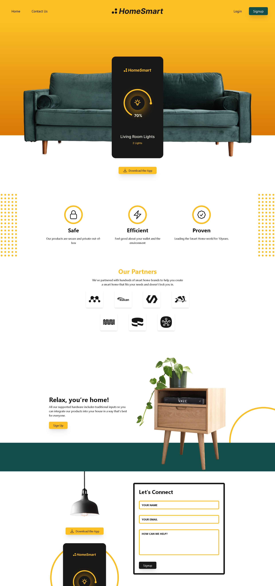
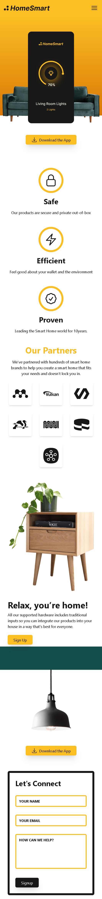

# HomeSmart Landing Page - Tailwind CSS Project

## Table of contents

- [Overview](#overview)
  - [Screenshot](#screenshot)
  - [Links](#links)
- [My process](#my-process)
  - [Built with](#built-with)
  - [What I learned](#what-i-learned)
  - [Continued development](#continued-development)
- [Author](#author)
- [Acknowledgments](#acknowledgments)

## Overview

This is the homeSmart website, a responsive landing page built using TailwindCSS. The site is designed to showcase smart home products, their features, and partner brands while encouraging users to sign up and download the app..

### Screenshot

- **HomeSmart Landing Page : Desktop design**

- **HomeSmart Landing Page : Mobile design**

### Links

- Solution URL: [https://github.com/hoor23/HomeSmart__LandingPage.git](https://github.com/hoor23/HomeSmart__LandingPage.git)
- Live Site URL: [https://hoor23.github.io/HomeSmart__LandingPage/](https://hoor23.github.io/HomeSmart__LandingPage//)

## My process

### Built with

- **HTML5** : For structuring the content.
- **Tailwind CSS** : For styling and creating responsive designs.
- **JavaScript** : Used to implement the mobile menu functionality.

### What I learned

During this project, I gained more familiarity with TailwindCSS utility classes and its responsive design capabilities. I also improved my ability to integrate dynamic functionality using JavaScript, such as toggling the mobile navigation menu.

Some key learnings include:

- Building responsive layouts using flex, grid, and TailwindCSS breakpoints.
- Creating interactive elements like buttons and navigation that adapt to user actions.
- Efficiently structuring HTML and TailwindCSS classes for cleaner and more maintainable code.

### Continued development

Future development of the homeSmart site will focus on:

- **Accessibility improvements** : Ensuring the website is fully accessible with screen readers and follows best practices for keyboard navigation.
- **SEO optimization** : Implementing meta tags, improving load times, and enhancing search engine visibility.
- **Advanced animations** : Using TailwindCSS's animation utilities or adding custom animations for a smoother and more interactive user experience.
- **Backend integration** : Linking the contact form to a backend server for handling form submissions and building out user authentication.
## Author
- Frontend Mentor - [hoor23](https://www.frontendmentor.io/profile/hoor23)
- Github - [hoor23](https://github.com/hoor23)
- LinkedIn - [Hoor Seyda](www.linkedin.com/in/hoor-seyda-901176222)

## Acknowledgments

Special thanks to:

- The TailwindCSS team for creating an incredibly powerful and easy-to-use CSS framework.
- https://youtu.be/xpGNcQDmV2A?feature=shared